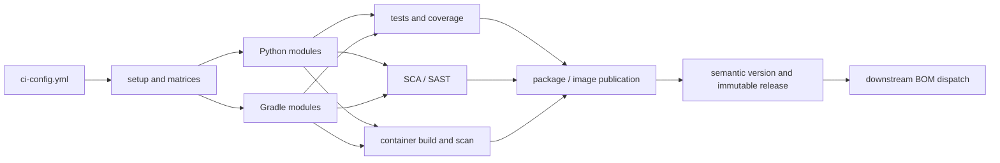

# Secure Reusable Workflows

Portable GitHub Actions workflows for multi-module Python and Java/Gradle
projects. The repository distills the architecture visible in the supplied
reference screenshots while deliberately excluding private infrastructure,
credentials, organization identifiers, and proprietary action references.

## What is included

| Workflow | Purpose |
| --- | --- |
| `python-build-publish.yml` | Build Python packages and/or containers, run pytest coverage, Snyk SCA/SAST, Trivy image scanning, publish artifacts, and write build summaries. |
| `java-build-publish.yml` | Build Gradle modules and/or containers, archive test and JaCoCo reports, run Snyk SCA/SAST and Trivy, publish packages, and summarize results. |
| `create-immutable-tag.yml` | Idempotently create `vX.Y.Z`, update the floating `vX` tag, and create a GitHub release. |
| `semantic-release.yml` | Calculate the next conventional semantic version for `main` or a `hotfix/X.Y` branch, then call the immutable-tag workflow. |
| `dispatch-bom.yml` | Require a tag ref, calculate the release delta, and notify a downstream BOM repository with `repository_dispatch`. |
| `lint.yml` | Validate YAML and GitHub Actions syntax on every pull request. |

## Design



The build workflows use least-privilege permissions, typed reusable-workflow
inputs, configurable registries, artifact retention, concurrency controls, and
security gates. Scans produce artifacts even when a caller chooses advisory
mode with `ignore-scan-errors: true`.

## Consumer configuration

Add `ci-config.yml` to the calling repository:

```yaml
python-version: "3.12"
java-version: "21"
components:
  - name: api
    type: python-docker
    release-notes: true
  - name: worker
    type: python
  - name: service
    type: gradle-docker
  - name: library
    type: gradle
release:
  auto: false
bom:
  repository: your-org/platform-bom
```

Component directories should match their `name`. Python modules use
`pyproject.toml` (or compatible build metadata); Gradle modules use the root
wrapper; Docker components include a `Dockerfile` in their module directory.

## Calling a build workflow

```yaml
name: CI
on:
  push:
    branches: [main]
  pull_request:

jobs:
  python:
    uses: YOUR_ORG/secure-reusable-workflows/.github/workflows/python-build-publish.yml@v1
    with:
      publish-package: ${{ github.event_name == 'push' }}
      push-image: ${{ github.event_name == 'push' }}
      registry: ghcr.io
    secrets:
      registry-username: ${{ github.actor }}
      registry-password: ${{ secrets.GITHUB_TOKEN }}
      snyk-token: ${{ secrets.SNYK_TOKEN }}
```

Use the Java workflow identically, substituting
`java-build-publish.yml`. All publishing inputs default to `false`; callers
must opt in explicitly.

## Required and optional secrets

- `registry-username` / `registry-password`: required only when pushing images.
- `package-username` / `package-password`: required for a private Python or
  Gradle package registry.
- `snyk-token`: required only when `snyk-scan` is enabled.
- `bom-token`: fine-grained token or GitHub App token with access to the target
  BOM repository.

Prefer GitHub environments and OIDC/trusted publishing where supported. Never
put credentials, internal proxy addresses, or tenant identifiers in workflow
source.

## Release conventions

`semantic-release.yml` recognizes Conventional Commit prefixes:

- `feat!:` or `BREAKING CHANGE:` -> major
- `feat:` -> minor
- everything else -> patch

Hotfix branches must be named `hotfix/X.Y`; they increment the patch within
that release line. Tags are immutable, while `vX` is intentionally updated as
the floating major-version reference for reusable-workflow consumers.

## Local validation

```bash
./scripts/validate.sh
```

The script validates YAML with Ruby and uses `actionlint` when it is installed.
